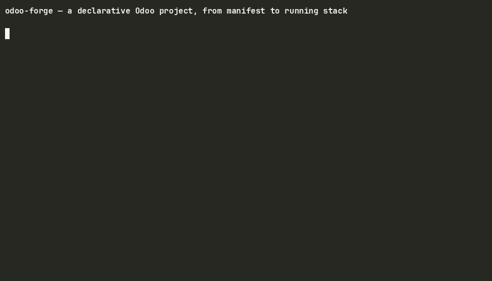

# odoo-forge

[](LICENSE)
[](pyproject.toml)
[](#architecture)

**A declarative platform for composing Odoo projects: layered manifests, resolved overrides, and pluggable execution backends.**

[Español](README.es.md) · [Documentation](docs/00-master-index.md) · [Roadmap](ROADMAP.md)

---

## The problem

An Odoo project is normally assembled by hand: a fixed layout of cloned repositories, a hand-maintained `addons_path`, a bespoke `docker-compose.yml`, and version pinning that lives in someone's memory. Reproducing a deployment means reproducing a ritual.

odoo-forge models a project as **data** instead. Layers, versions, overrides, credentials and runtime become a declarative definition — `project.yaml` resolved into a `project.lock` — that can be validated, locked to exact commits, materialized onto disk, and provisioned against a chosen backend.

The domain core stays free of infrastructure. Git, Docker, PostgreSQL, the image registry and CI pipelines all sit behind ports, so a new execution surface is a new adapter, never a rewrite.

## Status

This is an **early-stage project under active development** (first commit July 2026, single maintainer). It is honest about its boundaries.

**Operational today**

- `project.yaml` / `project.lock` handling, with drift detection
- Effective resolution of layers and overrides
- Git-backed workspace materialization
- Backend planning derived from materialized state
- Local Odoo + PostgreSQL backend on Docker
- Isolated `DatabaseProvider` adapter for PostgreSQL on Docker
- GHCR image operations (resolve, publish, pull, exists)
- Image factory for base images
- SOPS/age-backed Enterprise credential handling
- End-to-end database copy with anonymization policy support

**Provider-neutral foundations, not yet wired to a managed flow**

Credentials, data artifacts, project catalog, durable operations, tenancy contracts, and data-environment domain services exist as implemented building blocks. The local `copy` flow is wired, but managed data-environment and control-plane workflows are not available.

**Target state**

Managed data environments, tenancy, control plane, RBAC, remote backends (EC2, Kubernetes, Fargate) and a web UI.

The canonical, structural source of truth for product state, dependencies, evidence and handoffs is [`docs/specs/platform/portfolio.json`](docs/specs/platform/portfolio.json). Prose in this README is a summary; the portfolio is authoritative.

## Quickstart



Requires Python 3.11+, [uv](https://docs.astral.sh/uv/), and a running Docker daemon for backend commands.

```bash
uv tool install odoo-forge-toolkit   # or: pipx install odoo-forge-toolkit / pip install odoo-forge-toolkit
forge --help
```

The PyPI distribution is named `odoo-forge-toolkit`; the command it installs is
`forge` and the import packages keep the `odoo_forge*` names.

To work on odoo-forge itself, install from source instead:

```bash
git clone https://github.com/aparragithub/odoo-forge.git
cd odoo-forge
uv sync
uv run forge --help
```

A minimal manifest looks like this:

```yaml
name: forge-min
odoo_version: "19.0"
edition: community
core:
  type: core
  url: https://github.com/odoo/odoo.git
  ref: "19.0"
client:
  addons_path: client/addons
workspace:
  checkout_timeout_seconds: 300
backend:
  odoo:
    bind_host: 0.0.0.0
    http_port: 18069
```

Validate it, pin every declared ref to a commit SHA, project it onto the filesystem, then bring the stack up:

```bash
uv run forge validate --manifest example/project.yaml
uv run forge lock     --manifest example/project.yaml
uv run forge project  --manifest example/project.yaml
uv run forge run      --manifest example/project.yaml
uv run forge status
```

See [`example/`](example/) for a complete working manifest.

## CLI

| Command family | Commands |
| --- | --- |
| Manifest and onboarding | `configure`, `validate`, `onboard`, `lock`, `project`, `unlock` |
| Local backend | `run`, `status`, `stop`, `destroy`, `logs`, `exec` |
| Data copy | `copy` |
| Images (GHCR) | `image-resolve`, `image-publish`, `image-pull`, `image-exists` |
| Pipelines | `pipeline-trigger`, `pipeline-status`, `pipeline-logs` |
| Maintenance | `doctor`, `rotate-enterprise-credential` |

Run `uv run forge <command> --help` for the full signature of any command.

## Architecture

Hexagonal, and enforced rather than aspirational: **10 import-linter contracts fail the build** if the domain core reaches for infrastructure, the CLI, or any adapter.

| Package | Role |
| --- | --- |
| `odoo_forge` | Pure domain — Pydantic models, manifest composition, ports |
| `odoo_forge_cli` | Typer presentation layer (`forge`) |
| `odoo_forge_git` | Git source provider |
| `odoo_forge_workspace` | Workspace materialization |
| `odoo_forge_docker` | Local Docker backend |
| `odoo_forge_postgres_docker` | PostgreSQL-on-Docker database adapter |
| `odoo_forge_registry` | GHCR image registry adapter |
| `odoo_forge_catalog` | Project catalog index adapter |
| `odoo_forge_pipeline_github` | GitHub Actions pipeline adapter |

Adapters depend on the core. The core depends on nothing but its own ports.

## Development

```bash
uv sync
uv run pytest                     # unit tests (integration deselected by default)
uv run pytest -m integration      # real-daemon backend tests
uv run pytest -m real_docker      # Docker PostgreSQL acceptance tests
uv run ruff check .
uv run mypy src
uv run lint-imports               # architecture contracts
```

## Documentation

| Entry point | What it covers |
| --- | --- |
| [`ROADMAP.md`](ROADMAP.md) | What works today, what is built but not wired, and what comes next |
| [`docs/comparison.md`](docs/comparison.md) | How odoo-forge compares to doodba, hand-rolled compose and Odoo.sh — including when not to use it |
| [`docs/recipes/`](docs/recipes/README.md) | Task-oriented guides: add an addon layer, override with your fork, Enterprise credentials |
| [`docs/00-master-index.md`](docs/00-master-index.md) | Index of all maintenance documentation |
| [`docs/diagrams/odoo-forge-current-implementation-guide.md`](docs/diagrams/odoo-forge-current-implementation-guide.md) | The exact boundary of what is implemented today |
| [`docs/01-repository-map.md`](docs/01-repository-map.md) | Repository structure |
| [`docs/06-docs-and-openspec-lifecycle.md`](docs/06-docs-and-openspec-lifecycle.md) | How docs and specs are kept in sync |

## Specs and roadmap

Development is spec-driven. Specifications live under [`openspec/specs/`](openspec/specs/) as the accumulated baseline; changes flow through `openspec/changes/` and land in `openspec/changes/archive/` once complete.

- **No change is currently active.** `openspec/changes/` holds only the archive.
- 46 completed changes are archived under [`openspec/changes/archive/`](openspec/changes/archive/), including `2026-07-17-sp-data-environments`.
- [`docs/specs/2026-07-14-stabilization-roadmap.md`](docs/specs/2026-07-14-stabilization-roadmap.md) is historical stabilization context — a sequence, not an authoritative inventory of active work.

## Direction

1. **Operational foundation** — image factory, CLI core, workspace materialization, local Docker backend, PostgreSQL adapter, GHCR adapter. *Implemented.*
2. **Provider-neutral foundations** — credentials, data artifacts, `DatabaseProvider`, project catalog, durable operations. *Implemented, not yet joined to managed flows.*
3. **Platform workflows** — managed data environments, tenancy, control plane, governance, per-actor journeys. *Blocked, planned or absent per `portfolio.json`.*
4. **Remote surfaces and interfaces** — EC2, Kubernetes, Fargate, RBAC, web UI. *Target state.*

## Contributing

Issues and pull requests are welcome — start with [CONTRIBUTING.md](CONTRIBUTING.md) and the [`good-first-issue`](https://github.com/aparragithub/odoo-forge/issues?q=is%3Aissue+is%3Aopen+label%3Agood-first-issue) label. Every change lands through a pull request tied to an open issue; nothing is pushed straight to `main`.

## License

[Apache License 2.0](LICENSE) — Copyright 2026 Angel Parra.
