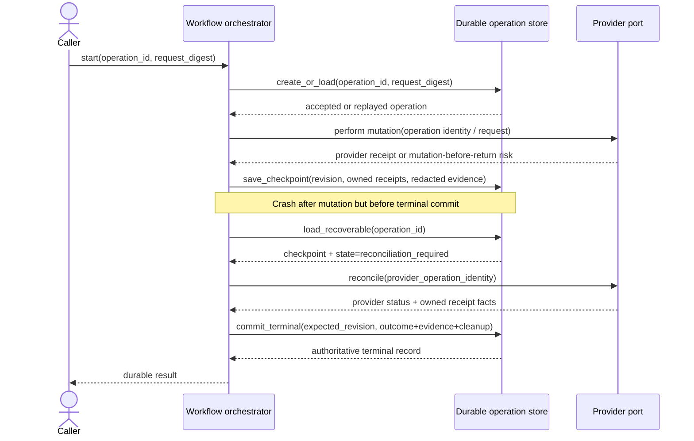

# Design: Durable Operations Capability

## Technical Approach

Add a provider-neutral durable-operations core that owns replay safety, monotonic lifecycle, durable checkpoints, authoritative terminal commit, workflow-level recovery, residual cleanup visibility, and redacted evidence. The capability stays contract-first: it defines the pure-domain models, transition rules, and persistence/recovery ports that any later control-plane or local adapter MUST satisfy, without selecting the final store, scheduler, or operational topology.

The design composes with existing provider concepts instead of replacing them. `OperationIdentity` remains the lower-level provider correlation handle; provider `CreationReceipt`, `CleanupReport`, and reconcile semantics become inputs to workflow checkpoints, terminal evidence, and compensation records. Workflow durability remains a separate layer that decides whether to resume, reconcile, compensate, or surface residual work.

## Component Boundaries

| Component | Responsibility |
|---|---|
| `src/odoo_forge/durable_operations/types.py` | Immutable operation identity binding, request digest, lifecycle state, revision, checkpoint, terminal record, compensation scope, residual work, and redacted evidence models. |
| `src/odoo_forge/durable_operations/service.py` | Pure transition rules for accept/replay/conflict, checkpoint advancement, terminalization, residual creation, and recovery planning. |
| `src/odoo_forge/durable_operations/errors.py` | Typed redacted failures for replay conflict, invalid transition, unknown outcome, incomplete terminal commit, and unsafe compensation requests. |
| `src/odoo_forge/ports/durable_operation_store.py` | Persistence contract for create-or-load, checkpoint append/replace, compare-and-swap terminal commit, residual updates, and recovery queries. |
| `src/odoo_forge/ports/durable_operation_recovery.py` | Port for enumerating recoverable operations and recording recovery attempts/results without making scheduler choices here. |
| Workflow orchestrators | Execute business steps, call provider/data-artifact ports, attach invocation-owned receipts, and submit checkpoint/terminal bundles through the durable-operations contract. |

## Architecture Decisions

| Decision | Rejected alternative | Rationale |
|---|---|---|
| Separate workflow durability from provider reconciliation | Let provider `reconcile(OperationIdentity)` be the whole recovery story | Provider reconciliation answers provider mutation status; workflow durability must also reason about business state, evidence completeness, compensation, and residual cleanup. |
| `operation_id + request_digest` defines replay safety | Operation ID alone | Same ID with different request meaning must fail deterministically instead of replaying unsafe intent. |
| Monotonic lifecycle with explicit `cleanup_required` / residual state | Terminal success/failure plus logs | Residual cleanup is first-class operational state, not commentary. |
| Checkpoints store resume-safe facts, not arbitrary step logs | Free-form event stream as the primary contract | Consumers need deterministic recovery decisions first; event detail can remain adapter-owned later. |
| Compare-and-swap terminal commit with revision binding | Separate writes for outcome, evidence, and cleanup obligations | Prevents torn authoritative visibility after crash or retry. |
| Redacted evidence as a dedicated model | Reusing raw provider diagnostics | Existing specs forbid secrets, connection material, and data bytes in durable records. |
| Invocation-owned compensation scope | Name- or label-based best-effort cleanup | Aligns with `CreationReceipt` and existing created/adopted/external ownership semantics. |

## Lifecycle Model

```text
accepted
  -> in_progress
  -> reconciliation_required
  -> terminal_pending
  -> succeeded | failed
  -> cleanup_required
  -> closed
```

Rules:
- Lifecycle is forward-only; revision increments on every durable change.
- `accepted` means the operation identity and request meaning are durably bound.
- `in_progress` means at least one resume-safe checkpoint exists or active work was durably acknowledged.
- `reconciliation_required` means a mutation may have happened but no later authoritative checkpoint/terminal commit proves the outcome.
- `terminal_pending` means the workflow has a terminal bundle prepared but not yet durably committed.
- `succeeded` and `failed` are authoritative only through the terminal compare-and-swap commit.
- `cleanup_required` means business outcome is known but residual cleanup remains open.
- `closed` means no residual obligations remain.

## Data Flow and Contracts

1. A workflow submits `operation_id`, `request_digest`, and initial redacted intent metadata.
2. The store performs `create_or_load(operation_id, request_digest)`.
   - Same digest: replay existing operation.
   - Different digest: reject as conflict.
3. The orchestrator performs work and records checkpoints containing only resume-safe state:
   - last safe phase
   - provider correlation handles such as `OperationIdentity`
   - invocation-owned receipts such as `CreationReceipt`
   - redacted evidence snapshots
   - compensation scope and residual candidates
4. If a crash boundary leaves mutation outcome unknown, the service marks `reconciliation_required` and drives recovery using checkpoint facts plus provider reconciliation inputs.
5. When terminal outcome is known, the orchestrator builds one terminal bundle:
   - outcome
   - redacted evidence
   - cleanup obligations / residual work
   - owned compensation receipts
   - terminal revision expectation
6. The store executes `commit_terminal(operation_id, expected_revision, bundle)` atomically.
7. Recovery readers treat only the committed terminal record as authoritative. Anything else remains resumable or reconcilable, never silently successful.

## Representative Crash-Safe Flow



Recovery rule: if the checkpoint proves only that a mutation was attempted, recovery MUST reconcile or compensate from recorded facts. It MUST NOT blindly repeat the unsafe mutation.

## Interfaces / Contracts

| Contract | Purpose |
|---|---|
| `DurableOperationRecord` | Current authoritative durable view: identity binding, revision, lifecycle, latest checkpoint summary, terminal record, residual state. |
| `DurableCheckpoint` | Resume-safe progress snapshot with typed phase, owned receipts, provider correlation IDs, and redacted evidence. |
| `TerminalCommitBundle` | One atomic publication unit containing final outcome, evidence, cleanup obligations, and compensation ownership facts. |
| `RecoveryPlan` | Pure-domain decision describing `resume`, `reconcile`, `compensate`, or `surface_residual`. |
| `DurableOperationStore` | Port for `create_or_load`, `save_checkpoint`, `mark_reconciliation_required`, `commit_terminal`, `resolve_residual`, and `list_recoverable`. |

Provider alignment:
- `OperationIdentity` remains the provider-facing correlation value.
- `CreationReceipt` and `CleanupReport` remain provider-owned types and are carried opaquely inside durable checkpoints/evidence.
- Workflow recovery MAY consult provider `reconcile(OperationIdentity)`, but the durable workflow outcome is published only by the durable-operations terminal commit.

## File Changes

| File | Action | Description |
|---|---|---|
| `src/odoo_forge/durable_operations/types.py` | Create | Immutable durable operation values and redacted evidence types. |
| `src/odoo_forge/durable_operations/service.py` | Create | Pure lifecycle, replay, recovery-plan, and terminalization logic. |
| `src/odoo_forge/durable_operations/errors.py` | Create | Typed redacted durable-operation failures. |
| `src/odoo_forge/durable_operations/__init__.py` | Create | Public re-exports. |
| `src/odoo_forge/ports/durable_operation_store.py` | Create | Provider-neutral persistence and compare-and-swap contract. |
| `src/odoo_forge/ports/durable_operation_recovery.py` | Create | Recovery enumeration / recording contract. |
| `tests/durable_operations/test_types.py` | Create | Invariants for immutability, redaction, ownership scope, and residual identifiers. |
| `tests/durable_operations/test_service.py` | Create | Replay/conflict, monotonic lifecycle, recovery planning, and terminal commit rules. |
| `tests/ports/test_durable_operation_store.py` | Create | Structural port and fake-store contract tests. |

## Testing Strategy

| Layer | What to prove | Approach |
|---|---|---|
| Unit | Request-digest conflicts, monotonic state, revision monotonicity, redaction, owned-only compensation scope | Pure pytest model/service tests. |
| Contract | Same-input replay, mismatched replay conflict, checkpoint resume, unknown outcome -> reconciliation, atomic terminal publication semantics | Fake in-memory store with compare-and-swap behavior and injected crash windows. |
| Property | No transition regresses lifecycle; authoritative terminal record is unique per operation revision | Property-oriented transition checks. |
| Architecture | Durable core stays provider-neutral and pure-core | import-linter, mypy, and adapter-free import assertions. |

## Rollout and Rollback

Deliver in chained additive slices under the 400-line review budget: core models/errors, pure service, store port/contracts, then first consumer adoption. No workflow should depend on this capability until the contract tests pass. Rollback means removing or disabling consumer adoption while leaving unfinished durable-operation adapters non-authoritative; no partial adapter may expose terminal success/failure without the full compare-and-swap contract.

## Open Questions

- The final persistence adapter shape remains intentionally deferred: local journal, control-plane authority, or another store may implement the same ports later.
- Recovery scheduling/retention policy remains out of scope; this capability only defines what recoverable state and residual obligations must exist.
- Downstream workflows may need small evidence extensions, but they must fit inside the redacted evidence contract rather than bypass it.
