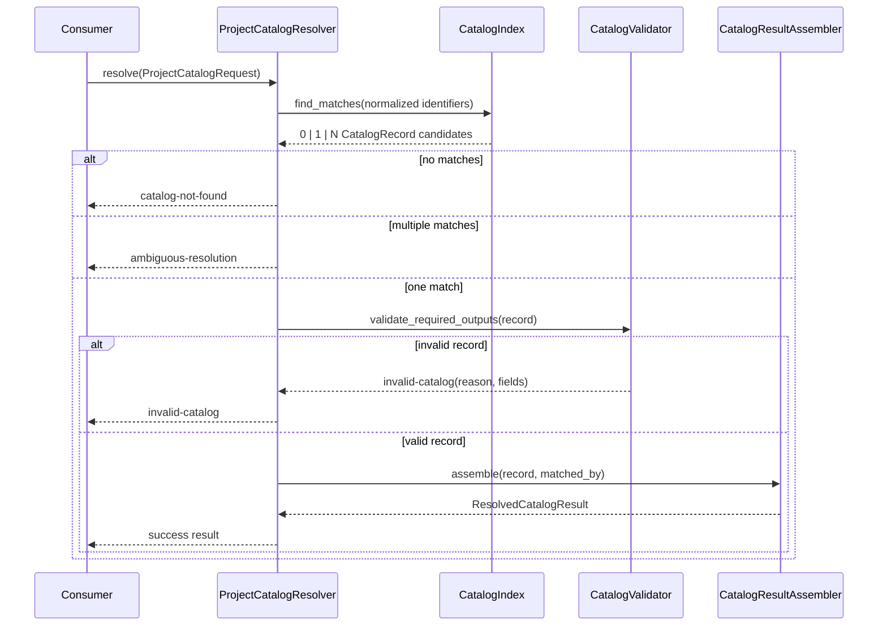

# Design: CAP-PROJECT-CATALOG

## Outcome

Introduce one contract-first `ProjectCatalogResolver` boundary that turns client/project intent into a single authoritative `ResolvedCatalogResult` or a typed resolution failure. The capability owns lookup, default resolution, and failure classification only. It does not own onboarding workflows, control-plane persistence, provider selection, tenancy, or data-stream behavior.

## Quick path

1. Accept a `ProjectCatalogRequest` with catalog-supported identifiers.
2. Resolve exactly one `CatalogRecord` from catalog authority.
3. Materialize a full `ResolvedCatalogResult` with manifest reference, source context, data-policy default, and target default.
4. Return a typed failure when the request is ambiguous, not found, or catalog-invalid.

## Design goals

- Keep one authoritative lookup/defaulting contract for all downstream consumers.
- Reuse existing manifest/source/workspace foundations without pulling adapters into this capability.
- Preserve strict boundary separation from workflow, persistence, and tenancy concerns.
- Make success and failure shapes stable enough for downstream code to branch on types, not error text.

## Existing foundations

| Existing asset | Role in this design |
|---|---|
| `src/odoo_forge/manifest/schema.py` | Defines the manifest domain referenced by the catalog result |
| `src/odoo_forge/ports/source_provider.py` | Informs the shape of resolved source context without choosing adapter behavior |
| `src/odoo_forge/ports/workspace_provider.py` | Confirms downstream consumers need a stable target/workspace default, not workspace orchestration |
| `src/odoo_forge/backend/plan.py` | Shows downstream planning already consumes fully resolved inputs and benefits from one upstream authority |

## Service boundary

### Owned by CAP-PROJECT-CATALOG

- Accepted identifier contract for project/client lookup
- Catalog record selection rules
- Catalog-owned default resolution
- Stable success result shape
- Stable failure classes
- Authority metadata for traceability

### Explicitly out of scope

- Onboarding or environment-request orchestration
- Control-plane storage, mutation, sync, or approval flows
- Provider selection or provider adapter routing
- Tenancy/RBAC/audit semantics
- Data-artifact lifecycle, database copy, anonymization, or stream/runtime decisions
- Workspace checkout/materialization execution

## Proposed domain model

### Request model

```text
ProjectCatalogRequest
- client_key: str | None
- project_key: str | None
- project_slug: str | None
- manifest_name: str | None
```

Design choice:
- The contract allows multiple optional identifiers, but the catalog schema defines which combinations are sufficient.
- The resolver normalizes identifiers and asks the catalog index for matches.
- A request is valid only when it resolves to exactly one catalog record.

### Authority model

```text
CatalogRecord
- record_id: str
- client_key: str
- project_key: str
- aliases: CatalogAliases
- manifest_ref: ManifestRef
- source_context: CatalogSourceContext
- defaults: CatalogDefaults

CatalogAliases
- project_slugs: list[str]
- manifest_names: list[str]

ManifestRef
- manifest_name: str
- manifest_path: str

CatalogSourceContext
- source_set_id: str
- repos: list[CatalogRepoRef]

CatalogRepoRef
- url: str
- ref: str
- role: str

CatalogDefaults
- data_policy: DataPolicyDefault
- target: TargetDefault
```

Design choices:
- `record_id` is the canonical authority identifier returned to consumers.
- `manifest_ref` stays as a reference, not a loaded `Manifest`, so this capability remains lookup-only.
- `source_context` is resolved enough for downstream consumers to understand the authoritative source set, but it does not execute `SourceProvider.resolve_ref` or materialize workspaces.
- `defaults` are catalog-owned outputs, not hints.

### Success model

```text
ResolvedCatalogResult
- authority_record_id: str
- matched_by: MatchedIdentifier
- manifest_ref: ManifestRef
- source_context: ResolvedSourceContext
- data_policy_default: DataPolicyDefault
- target_default: TargetDefault
```

```text
ResolvedSourceContext
- source_set_id: str
- repos: list[CatalogRepoRef]
```

Design choices:
- Every field is required on success.
- `matched_by` gives traceability without exposing catalog internals.
- `ResolvedSourceContext` remains declarative so onboarding/request flows can consume it without re-running catalog logic.

### Failure model

```text
ProjectCatalogResolutionFailure
- type: "ambiguous-resolution" | "catalog-not-found" | "invalid-catalog"
- request_fingerprint: str
- details: structured payload
```

Structured payload by class:
- `ambiguous-resolution`: matched `record_ids`, matched identifier dimensions
- `catalog-not-found`: normalized identifiers used for lookup
- `invalid-catalog`: selected `record_id`, invalid fields, reason code

Design choice:
- Failures are typed and machine-branchable.
- No downstream consumer should parse free-form text to know what happened.

## Lookup architecture

```text
ProjectCatalogResolver
  -> CatalogIndex
  -> CatalogValidator
  -> CatalogResultAssembler
```

### `ProjectCatalogResolver`

Pure application service for this capability.

Responsibilities:
- normalize request identifiers
- ask `CatalogIndex` for candidate records
- enforce cardinality rules
- validate the selected record for required outputs
- assemble the authoritative success result
- emit typed failures

### `CatalogIndex`

Read-only boundary over the future catalog authority.

Responsibilities:
- expose lookup by supported identifier dimensions
- return zero/one/many candidate `CatalogRecord`s
- avoid consumer-specific tie-breaking

Non-responsibilities:
- persistence workflows
- external API transport
- tenant/provider logic

### `CatalogValidator`

Pure validation component.

Responsibilities:
- verify selected record contains `manifest_ref`, `source_context`, `data_policy`, and `target`
- verify no required field remains implicit at success time
- classify invalid authority failures with deterministic reason codes

### `CatalogResultAssembler`

Pure translator from `CatalogRecord` to `ResolvedCatalogResult`.

Responsibilities:
- preserve catalog-owned defaults as resolved outputs
- annotate `matched_by`
- avoid partial success shapes

## Lookup flow



## Resolution rules

### Identifier normalization

- Normalize all incoming identifier fields before lookup.
- Treat aliases as catalog-declared authority, not caller-side heuristics.
- Never derive missing identifiers by probing downstream systems.

### Match cardinality

- `0` matches => `catalog-not-found`
- `1` match => continue validation
- `>1` matches => `ambiguous-resolution`

### Default materialization

- If a catalog record inherits a default from catalog authority, the resolver returns the fully resolved value.
- Downstream consumers receive authoritative defaults, not unresolved inheritance chains.

### Validation gate

A success result requires all of these:
- manifest reference present
- source context present
- data-policy default present
- target default present

Anything less is `invalid-catalog`.

## Domain model choices

### Manifest reference, not manifest loading

Reason: `manifest/schema.py` models a manifest instance, but this capability should only point to the authoritative manifest. Loading/parsing the manifest belongs to the consumer or a later composition layer.

Tradeoff: consumers do one extra dereference step, but the catalog stays bounded and testable.

### Declarative source context, not provider execution

Reason: `SourceProvider` is an external port. The catalog should decide *which source set* applies, not resolve refs to commits.

Tradeoff: downstream composition still performs source resolution, but with one authoritative source set.

### Resolved defaults, not fallback instructions

Reason: the spec explicitly forbids consumers from re-implementing target/data-policy fallback logic.

Tradeoff: catalog authority must be complete enough to emit a final default, but that is EXACTLY the point of this capability.

## Failure classes

| Failure type | When it happens | Downstream meaning |
|---|---|---|
| `catalog-not-found` | No record matches normalized identifiers | Caller must correct identifiers or catalog contents |
| `ambiguous-resolution` | More than one record matches | Caller or catalog owner must disambiguate; no automatic tie-break |
| `invalid-catalog` | Exactly one record matched but required outputs are incomplete/invalid | Catalog authority exists but is not usable yet |

## Data flow

```text
ProjectCatalogRequest
  -> normalize identifiers
  -> CatalogIndex.find_matches()
  -> cardinality check
  -> CatalogValidator.validate_required_outputs()
  -> CatalogResultAssembler.assemble()
  -> ResolvedCatalogResult | ProjectCatalogResolutionFailure
```

## Contracts with adjacent capabilities

| Adjacent area | Contract with this design |
|---|---|
| Onboarding | Consumes `ResolvedCatalogResult`; does not decide lookup/defaults |
| Environment requests | Consumes `target_default` and `data_policy_default`; does not redefine them |
| Control plane | May store or route the result later, but is not the authority for resolution semantics |
| Source/workspace adapters | Execute later using resolved references/context; not part of lookup capability |
| Tenancy/provider catalog | Separate prerequisites that may constrain later workflows, not this resolution contract |

## Planned file changes

This design stays bounded to contract and core domain additions.

| File | Change |
|---|---|
| `openspec/changes/CAP-PROJECT-CATALOG/design.md` | Add this design artifact |
| `openspec/specs/project-catalog-resolution/spec.md` | No design-time change required; implementation will trace back here |
| `src/odoo_forge/project_catalog/` | Future home for pure domain models and resolver service |
| `src/odoo_forge/ports/` | Optional future read-only catalog authority port if implementation needs adapter separation |
| `docs/specs/platform/portfolio.json` | Future acceptance evidence update only |

## Implementation shape for later tasks

Suggested package split:

```text
src/odoo_forge/project_catalog/
  models.py        # request/result/failure/catalog record models
  resolver.py      # ProjectCatalogResolver
  validation.py    # CatalogValidator
  interfaces.py    # CatalogIndex protocol if needed
```

Reason: keep the new capability cohesive and independent from manifest parsing, backend planning, and external adapters.

## Testing strategy

### Unit tests

- resolves exactly one valid record to one full `ResolvedCatalogResult`
- returns `catalog-not-found` for zero matches
- returns `ambiguous-resolution` for multiple matches
- returns `invalid-catalog` when required resolved fields are missing
- preserves catalog-declared defaults as final outputs in the success result
- reports `matched_by` consistently for traceability

### Contract tests

- consumers can branch on failure type without parsing text
- successful result always contains all four authoritative outputs
- alias-based lookup never bypasses cardinality rules

### Non-goal tests

Do not test:
- source-provider network behavior
- workspace checkout/promotion behavior
- control-plane persistence
- provider or tenancy policy decisions

## Rollout

1. Approve this contract and keep the capability scoped.
2. Break implementation into a small pure-domain slice under the 400-line review budget.
3. Add acceptance evidence for `AC-CAP-PROJECT-CATALOG-READY` after implementation proves the success/failure contract.
4. Let onboarding/environment-request work consume the resolver later instead of inventing local lookup logic.

## Risks

| Risk | Impact | Mitigation |
|---|---|---|
| Catalog schema tries to encode workflow state | Scope blow-up | Keep records limited to lookup authority and defaults |
| Consumers ask resolver to load manifests or resolve SHAs | Boundary erosion | Keep result declarative and push execution to later composition layers |
| Defaults remain optional in success path | Contract drift | Enforce `CatalogValidator` hard gate on all required outputs |
| Alias rules become ad hoc | Ambiguity bugs | Centralize normalization and candidate matching in `CatalogIndex` |

## Decision summary

- One pure `ProjectCatalogResolver` owns project/client resolution.
- Success returns one complete authoritative result, never a partial.
- Failure classes are exactly `catalog-not-found`, `ambiguous-resolution`, and `invalid-catalog`.
- Manifest loading, source execution, workspace orchestration, workflow logic, control-plane persistence, provider selection, tenancy, and data-stream concerns stay OUT.

## Next step

Produce `sdd-tasks` that turn this bounded design into small implementation slices and explicit acceptance evidence work for `AC-CAP-PROJECT-CATALOG-READY`.
