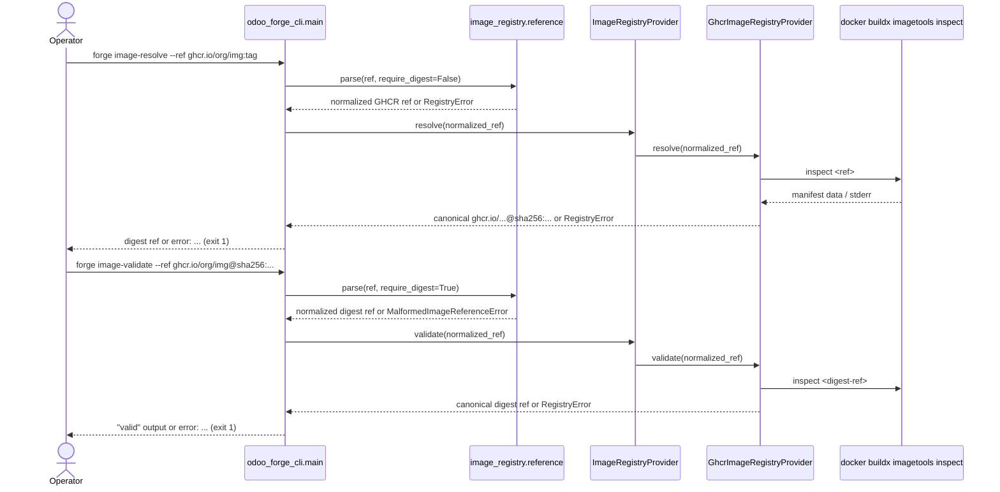

# Design: SP1-A — Immutable Image Identity Foundation

This slice adds GHCR-first image identity resolution and validation at the CLI only. It resolves mutable refs to canonical digest refs, validates digest refs remotely, and explicitly excludes pull execution, backend integration, multi-registry behavior, and `project.lock` persistence.

## Technical Approach

Mirror the existing `SourceProvider` / `ResolutionError` pattern. Add a pure `ImageRegistryProvider` port under `odoo_forge`, a pure registry error family plus ref-shape helper in core, and a concrete `odoo_forge_registry` adapter that shells out to `docker buildx imagetools inspect`. `src/odoo_forge_cli/main.py` remains the only composition root and the only place that catches the registry family and maps it to `error: ...` plus exit 1.

## Architecture Decisions

| Decision | Options | Tradeoff | Choice / Rationale |
|---|---|---|---|
| Registry inspection path | GHCR HTTP client; `docker buildx imagetools inspect` | HTTP adds protocol/auth code; Buildx matches existing subprocess adapters and current GHCR workflow usage in `.github/workflows/build-images.yml` | Use Buildx inspect. It stays adapter-local, avoids new deps, and matches current GHCR publishing/inspection conventions. |
| Error family | Adapter-local exceptions; core `RegistryError` family | Adapter-local exceptions would leak infra details into CLI code | Add `RegistryError(Exception)` plus `UnsupportedRegistryError`, `MalformedImageReferenceError`, `RegistryAuthenticationError`, `RegistryImageNotFoundError`, and `RegistryUnavailableError` in `src/odoo_forge/image_registry/errors.py`. This mirrors `ResolutionError` / `BackendError`. |
| Validation ownership | All validation in adapter; split local-vs-remote | Adapter-only validation hides pure rules inside GHCR code | Put unsupported-registry and malformed-reference checks in a pure core helper (`src/odoo_forge/image_registry/reference.py`). The GHCR adapter owns only remote inspection and stderr/exit classification for auth, not-found, and unavailable cases. |
| CLI shape | Nested `image ...`; flat commands | Nested is future-friendly; flat matches current CLI style | Use `image-resolve` and `image-validate` now, following current Typer command style and keeping SP1-A bounded. |

## Data Flow



The ownership boundary is intentional: the core helper decides "is this GHCR?" and "is this structurally a tag/digest ref for this command?"; the GHCR adapter decides "does this remote ref exist and what registry failure happened?"

## File Changes

| File | Action | Description |
|------|--------|-------------|
| `src/odoo_forge/ports/image_registry_provider.py` | Create | Pure resolve/validate port. |
| `src/odoo_forge/image_registry/errors.py` | Create | `RegistryError` base family and typed subclasses. |
| `src/odoo_forge/image_registry/reference.py` | Create | Pure GHCR-only ref parsing/normalization helper used before adapter calls. |
| `src/odoo_forge_registry/__init__.py` | Create | Adapter package export. |
| `src/odoo_forge_registry/provider.py` | Create | GHCR adapter using Buildx inspect and stderr classification. |
| `src/odoo_forge_cli/main.py` | Modify | Add `_make_image_registry_provider()`, `image-resolve`, `image-validate`, and `except RegistryError as exc` boundaries. |
| `pyproject.toml` | Modify | Register `odoo_forge_registry` package and add import-linter guard so core never imports the registry adapter. |
| `tests/ports/test_image_registry_provider.py` | Create | Port conformance tests. |
| `tests/adapters/test_registry_provider.py` | Create | GHCR success plus auth/not-found/unavailable mapping tests. |
| `tests/cli/test_image_registry.py` | Create | CLI success and fail-fast diagnostics, including unsupported registry and malformed reference cases. |

## Interfaces / Contracts

```python
class ImageRegistryProvider(Protocol):
    def resolve(self, ref: str) -> str: ...
    def validate(self, ref: str) -> str: ...
```

`resolve()` accepts normalized GHCR tag or digest refs and returns a canonical digest ref. `validate()` accepts normalized GHCR digest refs only and returns that canonical digest ref when the remote manifest exists.

## Testing Strategy

| Layer | What to Test | Approach |
|-------|-------------|----------|
| Unit | Core ref helper and `RegistryError` family | Pure tests for GHCR-only guard, digest-only validation, and message shape. |
| Integration | Adapter subprocess classification | Monkeypatch `subprocess.run`, mirroring existing git/docker adapter tests. |
| E2E | CLI mapping boundary | `CliRunner` tests that `src/odoo_forge_cli/main.py` catches `RegistryError` and emits single-cause output without tracebacks. |

## Migration / Rollout

No migration required. This is additive CLI-only behavior with no persisted state.

## Delivery Slice Alignment

- PR 1 / first slice: core port, GHCR reference/error helpers, registry adapter, and non-CLI tests.
- PR 2 / second slice: `image-resolve` + `image-validate` CLI wiring, fail-fast boundary diagnostics, CLI tests, and final docs/cleanup alignment for `sp1-a`.

## Open Questions

- [ ] None.
