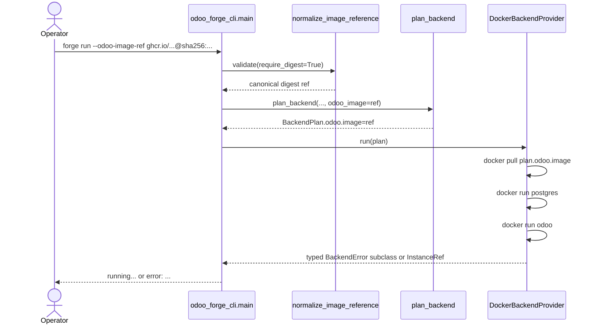

# Design: SP1-B — Runtime Digest Consumption for Local Docker

## Technical Approach

Add one explicit runtime override to `forge run`, validate it with the existing GHCR digest helper from `sp1-a`, and thread the normalized ref into `plan_backend` as an optional input. The plan remains pure and sets `BackendPlan.odoo.image` to either the override or the existing `odoo-forge-odoo:{odoo_version}` template. Only `DockerBackendProvider.run()` performs the new `docker pull`, keeping pull side effects and pull-error classification inside the Docker adapter.

## Architecture Decisions

| Decision | Options | Tradeoff | Choice / Rationale |
|---|---|---|---|
| Runtime input surface | Reuse `project.lock`; add `--odoo-image-ref`; mutate env only | Lockfile/env approaches blur scope or hide intent | Add one CLI option on `forge run` for a canonical digest ref. It is the minimum explicit surface and keeps the override ephemeral. |
| Plan contract | Mutate `BackendPlan` after planning; add optional `odoo_image` arg to `plan_backend` | Post-plan mutation scatters image selection ownership | Extend `plan_backend(..., odoo_image: str | None = None)`. The planner stays the single source of truth for `BackendPlan.odoo.image`. |
| Pull ownership | New port method like `pull()`; pull inside Docker adapter `run()` | Port growth forces all backends to model local-daemon behavior | Keep pull local to `src/odoo_forge_docker/provider.py`. `BackendProvider.run(plan)` already carries the chosen image. |
| Pull error family | Reuse registry errors; treat as generic `ContainerRunError`; add Docker-bound auth error | Registry errors describe remote inspect, not `docker pull` execution | Keep ownership at the Docker boundary: classify daemon unavailable, image not found, registry access denied, and generic run/start failures as `BackendError` subclasses. CLI rendering stays a single `except BackendError` boundary, so typed failures survive while output remains one normalized `error: ...` line. |

## Data Flow



The Docker adapter owns stderr interpretation for `docker pull`. It maps raw subprocess outcomes into typed backend errors (`DockerUnavailableError`, `ImageNotFoundError`, and a new authorization/access-denied backend error at minimum) before any terminal output happens. `src/odoo_forge_cli/main.py` continues catching only `BackendError` and rendering exactly one operator-readable `error: ...` line, so raw traceback and raw subprocess dumps never reach the terminal.

## File Changes

| File | Action | Description |
|------|--------|-------------|
| `src/odoo_forge_cli/main.py` | Modify | Add `forge run` digest option, validate it before planning, and preserve the single `BackendError` catch boundary that normalizes pull failures to one line. |
| `src/odoo_forge/backend/plan.py` | Modify | Accept an optional runtime Odoo image override and set `BackendPlan.odoo.image` from it. |
| `src/odoo_forge/backend/errors.py` | Modify | Add a Docker-bound authorization/access-denied error so pull failures stay typed. |
| `src/odoo_forge_docker/provider.py` | Modify | Pull `plan.odoo.image` before startup, classify `docker pull` stderr separately from container-start failures, and raise typed backend errors instead of leaking subprocess details. |
| `tests/backend/test_plan.py` | Modify | Cover override vs fallback image selection. |
| `tests/adapters/test_docker_provider.py` | Modify | Cover pull-before-run ordering and daemon/not-found/auth classification. |
| `tests/cli/test_backend.py` | Modify | Cover `forge run --odoo-image-ref` success, fail-fast normalization, and single-line pull diagnostics. |

## Interfaces / Contracts

```python
def plan_backend(
    manifest: Manifest,
    state: MaterializedState,
    instance: str = "default",
    odoo_image: str | None = None,
) -> BackendPlan: ...
```

`forge run --odoo-image-ref` accepts only canonical GHCR digest refs. `BackendProvider` does not change. The CLI contract for pull failures is a single operator-readable `error: ...` line produced from typed `BackendError` subclasses, never a traceback.

## Testing Strategy

| Layer | What to Test | Approach |
|-------|-------------|----------|
| Unit | Planner chooses override or fallback image | Extend `tests/backend/test_plan.py` with explicit `plan.odoo.image` assertions. |
| Integration | Docker adapter pull order and error mapping | Monkeypatch `subprocess.run` in `tests/adapters/test_docker_provider.py`; assert `docker pull` happens before Odoo start and auth/not-found/daemon failures stay distinct typed errors. |
| E2E | CLI boundary behavior | `CliRunner` tests for `forge run --odoo-image-ref` success, malformed/non-digest fail-fast, and pull-failure output as one normalized `error: ...` line without traceback. |

## Migration / Rollout

No migration required. The override is per-invocation only, adds no lockfile state, and does not alter non-Docker commands or backends.

## Open Questions

- [ ] None.
