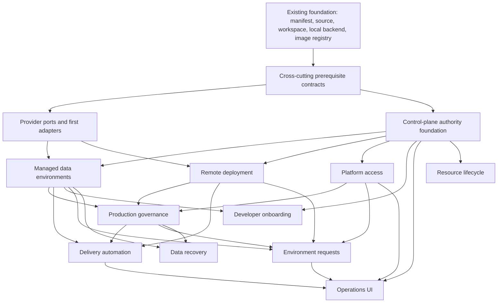

## Exploration: Platform Subproject Redefinition

### Current State

The current portfolio uses “SP” for several incompatible planning units: roadmap outcomes, ports, adapters, integrations, workflows, and implementation-sized SDD changes. That ambiguity is systemic, not isolated to SP-2. The roadmap states that every SP is one independent SDD change, but SP-2 repeatedly expanded from a database port into credentials, runtime ownership transfer, database/filestore consistency, durable audit, crash recovery, compensation, and CLI integration. Its full-context design gates exposed seven unresolved critical findings, and all five SP-2 planning changes were subsequently archived as superseded without implementation or canonical spec sync.

The inspected corpus comprised 17 platform source documents (four roadmap/design documents, ten SP briefs, one architecture HTML source, and two Mermaid sources), three canonical OpenSpec specifications, 27 relevant archived OpenSpec artifacts, and current code/test ownership for the implemented ports and adapters. `openspec/changes/` had no active change before this exploration.

#### Formal meaning of “SP” after the refactor

An **SP (platform subproject)** SHALL mean a roadmap-level, outcome-oriented epic with one accountable owner and aggregate acceptance contracts. It describes a durable actor or operator outcome and MAY require several capabilities, adapters, integrations, workflows, and implementation SDD changes. An SP is not itself assumed to be one SDD change.

An item qualifies as an SP only when all are true:

1. It produces an actor-visible or operator-visible platform outcome, not merely an interface or package.
2. Its outcome remains meaningful if the first provider or framework changes.
3. It owns a coherent capability boundary and explicit aggregate acceptance contracts.
4. Its prerequisites can be named without absorbing them into its own scope.
5. It can be decomposed into acyclic, implementation-sized SDD changes.

An item is instead a **reusable prerequisite** when multiple SPs consume it and it has no standalone roadmap outcome; a **provider port** when it defines an external-concern contract; an **adapter** when it implements one port for one provider; an **integration/cutover** when it changes ownership or routing between existing components; a **workflow/governance/orchestration capability** when it composes existing capabilities; and an **implementation-sized SDD change** when it can be specified, implemented, verified, and archived as one coherent delivery unit, potentially through forced chained PRs under the 400-line review budget.

#### Taxonomy

| Type | Definition | Completion evidence | Example |
|---|---|---|---|
| Roadmap epic/outcome (**SP**) | Actor/operator outcome with aggregate acceptance | Outcome contract and linked delivered changes | Managed data environments |
| Reusable platform prerequisite | Cross-cutting capability consumed by two or more SPs | Stable contract plus consumer proof | Secret handles and credential materialization |
| Provider port | Provider-neutral interface for one external concern | Contract/signature and architecture-boundary tests | `ImageRegistryProvider` |
| Adapter | One provider implementation of one port | Adapter conformance and provider integration evidence | `GhcrImageRegistryProvider` |
| Integration/cutover | Ownership, routing, or compatibility transition | Migration, compatibility, rollback, and end-to-end proof | PostgreSQL ownership extraction from `BackendProvider` |
| Workflow/governance/orchestration | Policy or multi-capability composition | State-machine/policy tests and cross-capability acceptance | Production promotion gate |
| Implementation-sized SDD change | One verifiable delivery unit | Proposal through archive; reviewable work units | Add Docker PostgreSQL adapter |

#### Complete current SP inventory

| ID | Current title/status | Claimed outcome | Declared dependencies | Delivered evidence | Evidence-based status |
|---|---|---|---|---|---|
| SP-1 | ImageRegistryProvider / DONE | Publish and consume digest-pinned server images | Phase 1 | Port and value types in `src/odoo_forge`; GHCR adapter in `src/odoo_forge_registry`; four CLI commands; local Docker digest override/pull; archived `sp1-a`, `sp1-b`, and `platform-image-registry-provider` verification | **Shipped prerequisite and local integration**, not a complete roadmap outcome. No control-plane build orchestration or higher/client image fabrication exists; no live-registry E2E evidence was found. |
| SP-2 | DatabaseProvider + DB lifecycle / planned | Managed provisioning, QA clone, DEV randomization, and pre-prod data | Slice 4b | Slice 4b ships backend-owned local PostgreSQL. No `DatabaseProvider` source package exists. Parent/core/runtime/governance/copy planning was archived superseded and unimplemented. | **Blocked outcome hypothesis**; current text conflates at least six ownership domains. |
| SP-3 | Remote BackendProvider adapters / planned | Deploy instances beyond local Docker | Slice 4b | Existing `BackendProvider` and local Docker adapter only; no remote adapter evidence in code/current-state diagram | **Blocked** by provider-neutral deployment-plan, tenancy, credentials, routing, and provider-selection decisions. |
| SP-4 | Control plane core / planned | Authoritative API, registry, provider composition, and reconciliation | SP-1/2/3 + source foundation | No control-plane implementation or canonical spec | **Not ready**; conflates persistence, API, provider catalog, reconciliation, tenancy, and secrets. |
| SP-5 | RBAC/auth / planned | Authenticated, role-authorized platform access | SP-4 | No identity port/adapter or auth implementation | **Not ready**; role, tenant, token/session, and enforcement boundaries remain open. |
| SP-6 | CI/CD integration / planned | Repo-provenance build/test/promotion/deploy automation | SP-1/2/3/4; roadmap order also implies SP-5 | Phase 1 workflow exists, but no `PipelineProvider` or control-plane delivery workflow | **Not ready**; current brief conflates provider integration, artifact fabrication, data validation, promotion, and deploy governance. |
| SP-7 | Dev onboarding flow / planned | Client request to editable local workspace plus anonymized DB | SP-2, source/workspace foundation, SP-4 | Source, workspace, and local Docker foundations exist; no request/client-resolution/data workflow | **Outcome is valid but blocked** by project catalog, managed data, operation model, and auth/product decisions. |
| SP-8 | Instance lifecycle requests / planned | Role-gated PROD, QA-from-PROD, and randomized DEV requests | SP-2/3/4/5/10 | No implementation evidence | **Outcome is valid but oversized**; duplicates DEV/data behavior from SP-7 and promotion/governance from SP-6/SP-10. |
| SP-9 | Control panel / planned | Role-aware operational UI | SP-4/5; success criteria also consume SP-6/8 | No implementation evidence | **Valid experience outcome**, but dependencies and incremental release boundaries are incomplete. |
| SP-10 | Governance & lifecycle / planned | Audit, PROD guardrails, GC/retention, backups, and restore drills | SP-4 + SP-1/2/3 | No implementation evidence | **Must split**: production governance, resource lifecycle, and data recovery are distinct outcomes with different dependencies and operators. |

#### Per-SP diagnosis

| Current SP | Conflation / duplicated ownership | Hidden prerequisites / cycles | Readiness / obsolete assumptions |
|---|---|---|---|
| SP-1 | Port, GHCR adapter, CLI, local-runtime pull, and future artifact-delivery outcome share one status | Credentials/secrets and artifact provenance are external to the brief | “Model B” contradicts the founding design, where Model B means package composition. GHCR and local-prefetch decisions were implemented but remain listed as open. `DONE` overstates the unbuilt server-artifact outcome. |
| SP-2 | Provider contract, Docker adapter, backend cutover, capture/restore, filestore consistency, anonymization policy, audit, durable state, compensation, and CLI | Credential issuance/materialization, artifact transport, consistency leases, creator receipts, operation journal, residual reconciliation | The archived gate failures are direct systemic evidence. Slice 4b PostgreSQL is not a `DatabaseProvider` adapter despite the roadmap’s “dockerized PG DONE” shorthand. |
| SP-3 | Three adapters, plan translation, tenancy enforcement, secret injection, and operational endpoint concerns | SP-3 says SP-4 defines tenancy while SP-4 depends on SP-3: a hard cycle. Also needs provider-neutral deployment spec and provider-selection model. | “Reuse `BackendPlan` verbatim” is unsafe: current plan is local-Docker topology. One adapter per SDD change is required. |
| SP-4 | API transport, canonical persistence, migrations, reconciliation, provider selection, tenancy, and secret resolution | Depends on all SP-3 adapters instead of stable contracts; provider-selection principle is unresolved | Can start after contracts and foundational decisions, not after every adapter. “One adapter at init” cannot be treated as settled for a multi-target control plane. |
| SP-5 | Identity port/adapter, OIDC login, session handling, role mapping, authorization policy, and API enforcement | Tenant identity, secret/token handling, role ownership, break-glass access | Static role names are product hypotheses. Authentication and authorization need separate acceptance and integration changes. |
| SP-6 | Pipeline port/adapter, image fabrication, pre-prod data preparation, test gate, promotion, and deploy | Durable async operations, provenance/attestation, data-environment workflow, production policy/audit | SP-1 publishes already-built images; it does not own build orchestration. Production CD cannot precede the relevant SP-10 governance capability without an explicit policy hook. |
| SP-7 | Client lookup, request orchestration, source delivery, DB creation, local runtime, and CI handoff | Project/client catalog, async operation status, data policy, identity/authorization | Push observability is a soft SP-6 handoff but is currently written as success acceptance without a declared dependency. Decide whether control-plane-free CLI onboarding is a first release. |
| SP-8 | Three environment workflows plus placement, authorization, lineage, approvals, quotas, and audit | Shared request state machine, tenant/quota policy, durable operations | Randomized DEV overlaps SP-7; PROD promotion overlaps SP-6; approval/audit overlaps SP-10. Retain the outcome but decompose by request policy. |
| SP-9 | Dashboard, requests, updates, pipeline status, real-time state, and OIDC UI | Stable API contracts and operation/event model | Dependency table says SP-4/5, while success criteria require SP-6/8. Define incremental UI releases instead of one all-or-nothing change. |
| SP-10 | Audit, approvals, policy, TTL, cross-provider GC, image retention, backup scheduling, retention, and restore verification | Durable operations, resource ownership/reconciliation, provider deletion/backup primitives | Three operational outcomes are hidden under one title. SP-2 local audit and dump/restore ownership duplicates SP-10 unless primitive vs orchestration boundaries are formalized. |

#### Systemic findings

1. **Planning levels are collapsed.** The “one SP = one SDD” rule turns outcome briefs into unsafe implementation scope.
2. **Status is attached to the label, not the outcome.** SP-1’s code is real and must remain credited, but it proves a registry prerequisite and local integration, not the full control-plane image-delivery journey.
3. **Cross-cutting prerequisites are hidden inside the first consumer.** Secrets, tenancy, durable operations, creator ownership, artifact transport, and project/client resolution recur across SPs.
4. **Dependency cycles are documented.** SP-3 requires SP-4 tenancy while SP-4 requires SP-3; SP-6 production delivery requires guardrails owned later by SP-10.
5. **Ownership is duplicated.** SP-2/SP-10 share backup and audit concerns; SP-6/SP-10 share promotion gates; SP-7/SP-8 share randomized DEV creation; SP-1/backend integration share pull semantics.
6. **Provider contracts and provider implementations are counted as the same delivery.** Local backend-owned PostgreSQL is evidence for extraction, not evidence that `DatabaseProvider` exists.
7. **Historical design vocabulary drifted.** “Model A/B,” Phase 3 published layers, `PublishedLayer`, and one-adapter-at-init assumptions are reused with changed meanings.
8. **Operational evidence is weaker than some success wording.** SP-1 has strong unit/adapter/CLI verification and shipped code, but no live GHCR E2E was found; Slice 4b’s real-Docker test was deselected in archived verification.

#### Canonical formal SP document schema

Every formal SP document should use this order and normative meaning:

1. **Identity and status** — semantic ID, title, outcome owner, lifecycle status (`proposed`, `validated`, `active`, `partially delivered`, `achieved`, `superseded`), last evidence date, and successor/predecessor links. `Achieved` requires aggregate outcome evidence.
2. **Problem and outcome** — current pain, target outcome, measurable outcome indicators, and why this is roadmap-level.
3. **Actors and journeys** — primary actors, trigger, happy path, failure path, and delivered value.
4. **Owned capabilities** — only capabilities for which this SP is the sole outcome owner, classified by taxonomy.
5. **Reusable prerequisites** — capability IDs, required maturity, owner, evidence, and whether hard or soft.
6. **Provider/adapter boundary** — ports consumed or owned, adapters required for the first outcome, and adapters explicitly deferred.
7. **Exclusions and ownership transfers** — named non-goals and destination owner; no unowned “later” work.
8. **Dependency DAG** — hard/soft dependency, reason, acceptance handoff, evidence link, and cycle check.
9. **Decomposition** — implementation-sized SDD changes with type, input/output contract, acceptance, migration boundary, rollback, and forecast review slice.
10. **Acceptance contracts** — aggregate outcome scenarios, not package-level task lists; map each contract to evidence.
11. **Migration and compatibility** — existing users/resources, adoption, cutover order, rollback, deprecation, and historical-link preservation.
12. **Security and data sensitivity** — data classification, credentials, tenant boundary, authorization, audit, retention, deletion, and threat assumptions.
13. **Operational ownership** — owning team, SLO/readiness, observability source, incident/rollback path, cost/quota, lifecycle, and runbook responsibility.
14. **Open decisions** — decision, owner, due gate, blocking effect, options, and evidence needed. Separate product decisions from technical facts.
15. **Evidence and status links** — source specs, archived SDDs, code/tests, PRs/commits, verification reports, and known evidence gaps.

#### Revised portfolio and old-to-new traceability

Semantic IDs are recommended because old numeric IDs imply continuity where semantics changed. Final names require user/product confirmation.

| Old | Action | Proposed canonical item | Classification / status |
|---|---|---|---|
| SP-1 | **Reclassify + merge remainder** | `CAP-IMAGE-REGISTRY` plus delivered local digest integration; remaining artifact fabrication/promotion moves to `SP-DELIVERY-AUTOMATION` | Reusable prerequisite **delivered with operational-evidence gap**; no longer a standalone SP |
| SP-2 | **Retain outcome, rename, decompose** | `SP-DATA-ENVIRONMENTS` | SP outcome: safe provisioned, QA, DEV, and pre-prod data environments; blocked pending prerequisites and implementation changes |
| SP-3 | **Retain outcome, rename, split adapters** | `SP-REMOTE-DEPLOYMENT` | SP outcome; one target adapter per SDD after deployment-spec, tenancy, and credential prerequisites |
| SP-4 | **Retain outcome, narrow** | `SP-CONTROL-PLANE-AUTHORITY` | SP outcome; registry/API/reconciliation, decomposed from provider catalog, persistence, and tenancy prerequisites |
| SP-5 | **Retain outcome, decompose** | `SP-PLATFORM-ACCESS` | SP outcome; identity adapter, authentication, authorization policy, and API enforcement are separate changes |
| SP-6 | **Rename + merge SP-1 remainder** | `SP-DELIVERY-AUTOMATION` | SP outcome covering repo provenance through built artifact, validation, governed promotion, and deployment |
| SP-7 | **Retain and narrow** | `SP-DEVELOPER-ONBOARDING` | SP outcome for editable local workspace onboarding; consumes shared project/data/request capabilities |
| SP-8 | **Rename + deduplicate** | `SP-ENVIRONMENT-REQUESTS` | SP outcome for control-plane environment requests; reuse DEV/data workflows rather than re-owning them |
| SP-9 | **Retain with staged decomposition** | `SP-OPERATIONS-UI` | SP outcome; read-only inventory can precede request/pipeline modules |
| SP-10 | **Split** | `SP-PRODUCTION-GOVERNANCE` | SP outcome: policy, approval, append-only audit, and gated production changes |
| SP-10 | **Split** | `SP-RESOURCE-LIFECYCLE` | SP outcome: TTL, retention, quota, and orphan reconciliation across managed resources |
| SP-10 | **Split** | `SP-DATA-RECOVERY` | SP outcome: backup policy, retention, restore drills, and recovery evidence |
| — | **New prerequisite** | `CAP-CREDENTIALS` | Secret handles, issuance/materialization, redaction, and target-side injection |
| — | **New prerequisite** | `CAP-DURABLE-OPERATIONS` | Idempotent operation state, journal/recovery, terminal outcomes, and residual reconciliation |
| — | **New prerequisite** | `CAP-RESOURCE-OWNERSHIP` | Creator receipts, adoption, safe deletion, and orphan identity |
| — | **New prerequisite** | `CAP-TENANCY` | Tenant identity, isolation contract, quotas, and ownership boundaries |
| — | **New prerequisite** | `CAP-PROVIDER-CATALOG` | Registered adapters and global/per-instance provider selection |
| — | **New prerequisite** | `CAP-DATA-ARTIFACTS` | Database/filestore capture refs, checksums, consistency boundary, validation, and discard |
| — | **New prerequisite** | `CAP-PROJECT-CATALOG` | Client/project to manifest, source, data policy, and target defaults resolution |
| — | **New prerequisite** | `CAP-DEPLOYMENT-SPEC` | Provider-neutral desired deployment model distinct from local `BackendPlan` |

#### Evidence-grounded dependency DAG and waves

| Wave | Deliverables | Evidence/rationale |
|---|---|---|
| 0 | Complete, verify, and archive this documentation refactor | User gate; prevents superseded SP-2 planning from becoming source truth |
| 1 | Decide provider-selection scope and tenancy; specify `CAP-CREDENTIALS`, `CAP-DURABLE-OPERATIONS`, `CAP-RESOURCE-OWNERSHIP`, `CAP-DATA-ARTIFACTS`, `CAP-PROJECT-CATALOG`, `CAP-DEPLOYMENT-SPEC` | SP-2 gates and SP-3/4 cycle prove these cannot remain hidden |
| 2 | Implement isolated provider foundations: DatabaseProvider contract + first adapter; deployment spec + first remote adapter; IdentityProvider + first adapter; PipelineProvider + first adapter | Follows proven sibling-package/import-linter pattern; one adapter per SDD avoids SP-3 batch scope |
| 3 | Control-plane registry/persistence/API/reconciliation; database runtime cutover; data capture/governance primitives | Control plane needs stable contracts, not every adapter; cutovers require compatibility evidence |
| 4 | `SP-DATA-ENVIRONMENTS`, `SP-PRODUCTION-GOVERNANCE`, and `SP-REMOTE-DEPLOYMENT` aggregate acceptance | These establish safe data, target, and policy outcomes before production automation |
| 5 | `SP-DELIVERY-AUTOMATION`, `SP-DEVELOPER-ONBOARDING`, and `SP-ENVIRONMENT-REQUESTS` | Actor workflows compose proven lower-level outcomes |
| 6 | `SP-OPERATIONS-UI`, `SP-RESOURCE-LIFECYCLE`, and `SP-DATA-RECOVERY`, with earlier recovery work allowed where primitives exist | UI composes APIs/workflows; lifecycle/recovery require canonical ownership and provider primitives |

#### Decisions requiring user/product confirmation

1. Approve the outcome-level definition of SP and semantic renaming instead of preserving SP-1…SP-10 numbers.
2. Approve reclassifying shipped SP-1 as `CAP-IMAGE-REGISTRY` and moving the unbuilt artifact-delivery outcome into delivery automation.
3. Approve splitting old SP-10 into production governance, resource lifecycle, and data recovery outcomes.
4. Resolve Principle 3: one adapter globally at init versus per-instance selection from an approved provider catalog.
5. Select first Mirgor providers: database, remote target, IdP, CI engine, and secrets store.
6. Define tenant identity/isolation and role-to-capability policy, including break-glass and customer boundaries.
7. Confirm data policy by destination: DEV mandatory anonymization; QA/pre-prod default anonymization; conditions for real-production-data exceptions.
8. Decide whether first developer onboarding can be CLI/local without the control plane, or must be server-mediated and authenticated.
9. Select the first remote deployment target and whether routing/DNS/TLS is platform-managed or target-owned by contract.
10. Confirm whether the proposed new prerequisite capabilities are independently owned roadmap enablers or grouped under a platform-foundation program.

#### Technical facts that do not require product confirmation

- `ImageRegistryProvider`, its GHCR adapter, four registry CLI commands, and local Docker digest consumption are shipped and test-evidenced.
- Current local PostgreSQL is owned by `BackendPlan`/`DockerBackendProvider`; no `DatabaseProvider` implementation exists.
- All recent SP-2 parent/child plans are archived as superseded, unimplemented, and unverified; no delta was merged into canonical specs.
- Current `BackendPlan` models local Docker containers, network, volumes, mounts, and env; it is not provider-neutral remote deployment intent.
- The documented SP-3↔SP-4 tenancy dependency is cyclic.
- SP-6 and SP-9 success criteria consume capabilities absent from their declared hard dependencies.
- Historical OpenSpec archives are audit evidence and must not be rewritten during the documentation migration.

### Affected Areas

- `docs/specs/2026-07-08-platform-roadmap.md` — replace “one SP = one SDD,” formalize taxonomy, portfolio, statuses, and acyclic waves.
- `docs/specs/platform/SP-*.md` — migrate every current brief to the canonical schema; rename/split/merge without erasing old-to-new traceability.
- `docs/specs/platform/` — add a canonical portfolio/schema index and new documents created by SP-10 split or prerequisite formalization.
- `docs/specs/platform/platform-architecture.html` — align labels, statuses, actor flows, prerequisites, and provider-selection model.
- `docs/diagrams/odoo-forge-complete-platform.mmd` — replace flat port/SP equivalence with outcome, prerequisite, port, adapter, and workflow layers.
- `docs/diagrams/odoo-forge-current-implementation.mmd` — preserve shipped SP-1/local-backend evidence and distinguish implemented capability from roadmap outcome.
- `docs/specs/2026-07-05-modular-odoo-platform-design.md` — preserve as founding/historical design; add supersession/terminology cross-links only where needed.
- `docs/specs/2026-07-06-phase-2-slices-roadmap.md` — preserve delivered foundation evidence; clarify that backend-owned PostgreSQL is not a `DatabaseProvider` adapter.
- `docs/specs/2026-07-05-phase-1-image-factory-design.md` — preserve historical implementation evidence; link its factory output to the reclassified image prerequisite.
- `openspec/changes/archive/` and `openspec/specs/` — read-only evidence during the documentation refactor; no historical rewrite or behavioral spec sync is warranted unless a later delta explicitly changes canonical behavior.

#### Documentation migration and review slices

Use a forced feature-branch chain. Each slice must have link/status checks and remain under 400 changed lines; rewriting a file counts deletions plus additions.

1. **Taxonomy and schema** — add the platform portfolio index, SP definition, canonical template, status rules, and evidence policy.
2. **Roadmap portfolio** — update the master roadmap, old-to-new mapping, DAG, and waves without rewriting SP briefs yet.
3. **SP-1 evidence reclassification** — preserve delivered code/archive links, remove stale open decisions, and separate prerequisite from unbuilt outcome.
4. **SP-2 formalization** — rewrite as managed-data outcome with explicit prerequisite/change decomposition and superseded-planning evidence.
5. **SP-3 and SP-4** — resolve the documented dependency cycle in the docs and separate deployment adapter work from control-plane authority.
6. **SP-5 and SP-6** — formalize access and delivery outcomes, provider ports, governance hooks, and prerequisites.
7. **SP-7 and SP-8** — deduplicate DEV/data/request ownership and record the onboarding product decision.
8. **SP-9** — define staged read-only, request, and pipeline UI increments with exact dependencies.
9. **SP-10A** — replace old SP-10 traceably with production-governance outcome and links to successors.
10. **SP-10B/C** — add resource-lifecycle and data-recovery outcome documents, split further if changed-line forecast exceeds 400.
11. **Architecture sources** — update HTML and both Mermaid sources to the formal model; validate Mermaid before merge.
12. **Consistency closeout** — automated link/identifier/status/dependency checks, old-ID redirect/traceability review, and evidence audit.

### Approaches

1. **Outcome-first portfolio redefinition** — define SPs as outcomes, extract reusable prerequisites, and decompose every outcome into typed implementation changes.
   - Pros: Directly addresses the SP-2 failure mode, removes cycles/duplicate ownership, preserves implementation evidence without overstating outcomes, and supports future review-sized SDD work.
   - Cons: Renames and splits several roadmap items; requires explicit product decisions and broad documentation migration.
   - Effort: High

2. **Template retrofit with numeric IDs preserved** — add the schema to current SP-1…SP-10 while retaining each current boundary.
   - Pros: Lower link churn and easier short-term migration.
   - Cons: Preserves the exact semantic conflation that broke SP-2; “decomposition” would remain nested inside oversized SP documents and status ambiguity would continue.
   - Effort: Medium

3. **Capability catalog replacing SPs** — remove SPs and roadmap outcomes in favor of only ports, capabilities, and SDD changes.
   - Pros: Precise engineering ownership and implementation traceability.
   - Cons: Loses actor/outcome planning, makes product sequencing harder, and overcorrects an abstraction problem by deleting the roadmap level.
   - Effort: High

### Recommendation

Adopt **outcome-first portfolio redefinition**. Keep SP as the roadmap/outcome level, not the implementation unit. Preserve old IDs only as aliases in a traceability table; use semantic IDs for changed meanings. Extract the reusable prerequisite capabilities before opening fresh implementation work. Preserve SP-1’s shipped code, tests, PR/archive evidence, and local digest integration under the image-registry prerequisite, while moving the still-unbuilt build/release journey into delivery automation.

The next SDD proposal must remain documentation-only. It should plan the migration slices above, formalize the schema and portfolio, update diagrams, verify identifiers/links/DAG/status evidence, and archive the refactor. It must not create a new SP-2 proposal or modify product code/canonical behavior specs.

### Risks

- Semantic renaming can break links or erase historical credit unless old-to-new aliases and immutable archive links are mandatory.
- Documentation can accidentally settle product choices; unresolved choices must remain explicit blocking decisions with owners.
- A large rewrite can exceed reviewer capacity; the forced chain and 400-line changed-line gate must be enforced per slice.
- If prerequisites become vague “platform foundation” buckets, the same scope problem will recur; each prerequisite needs a precise contract and consumers.
- Status drift will return unless `achieved` is tied to aggregate outcome evidence rather than any delivered child change.
- Diagrams can become a second inconsistent source unless generated sources and status/link checks are verified together.
- The proposed Wave 6 placement of recovery is sequencing, not permission to defer production recovery controls; minimum backup/restore readiness must gate any production launch.

### Ready for Proposal

Yes. Proceed with a documentation-only `sdd-propose` for `platform-subproject-redefinition`, using hybrid persistence, forced chained delivery, and the 400-line budget. Carry the ten product decisions as explicit proposal/design gates. Do not open fresh SP-2 work until this documentation change is fully applied, verified, and archived.
