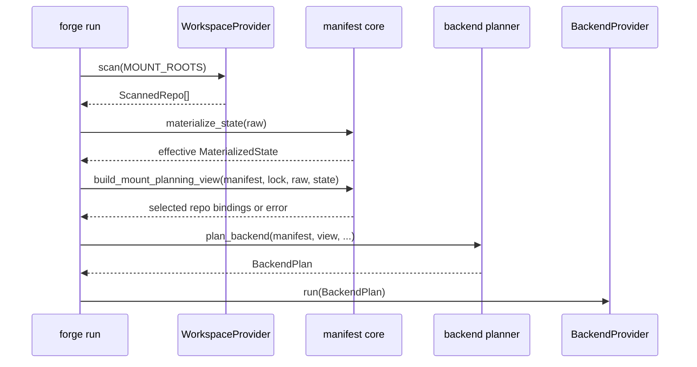

# Design: Make Backend Planning Consume Materialized State

## Technical Approach

`run` derives a validated, per-repository `MountPlanningView` from raw scan facts, projection/lock expectations, and `MaterializedState` drift evidence. `MaterializedState` remains the thin identity/commit model used by `detect_drift`; it carries no path or root authority. `plan_backend` consumes the view purely, while `BackendProvider` continues to receive only `BackendPlan`.

## Architecture Decisions

| Decision | Choice | Rationale |
|---|---|---|
| Effective authority | For each expected `(layer, url)`, select one valid source: a promoted worktree supersedes its read-only checkout; otherwise select the canonical read-only checkout. | `materialize_state()` applies worktree entries last, so its effective identity/commit already has this precedence independent of scan order. A promoted repo does not require its read-only counterpart to be active. |
| Mount granularity | Emit one bind mount per selected repository, not one mount per root. A worktree source is bound at that repository's canonical projected container path. | Root mounts would expose both copies when a root contains several repos. Per-repo bindings make replacement an effective-path operation and retain the entrypoint's canonical `/mnt/<root>/<layer>/<repo>` discovery layout. |
| Validation seam | Add pure `build_mount_planning_view`; keep `MaterializedState` unmodified. | Raw `ScannedRepo.path` is the authority needed to validate source and target paths without changing state or drift compatibility. |
| Planner and identities | `plan_backend(manifest, mount_view, *, instance="default", odoo_image=None, credentials=None)` requires the view; shared pure identity derivation serves `status`, `stop`, `logs`, and `exec`. | Provisioning fails closed, while identity commands remain scan-free. |
| Provider boundary | Keep `BackendProvider` unchanged. | It already receives `BackendPlan`; evidence validation belongs before the adapter boundary. |

## Data Flow



The view derives expected repositories from `WorkspacePlan`. For each identity, it validates the lock commit, layer, URL, and canonical path. A worktree is eligible only at `/mnt/worktrees/<layer>/<repo>` (the destination produced by `plan_unlock`); if valid, it selects that source over `/mnt/<category>/<layer>/<repo>`. Missing read-only evidence is therefore valid for a selected promoted repo, but not for any unpromoted expected repo.

The view emits exactly one binding per identity: `source_path` is the selected checkout and `container_path` is the read-only projection target. It never mounts `/mnt/<root>` parents or `/mnt/worktrees`, so no overlapping parent mounts can reveal both copies. Duplicate identities, duplicate container paths, conflicting read-only/worktree facts, malformed paths, unexpected facts, stale commits, and lock drift are rejected before a view exists.

## Interfaces / Contracts

```python
class MountEvidence(BaseModel):
    layer: str
    url: str
    source_path: Path       # selected read-only checkout or promoted worktree
    container_path: Path    # canonical projected /mnt/<root>/<layer>/<repo>
    read_only: bool

class MountPlanningView(BaseModel):
    mounts: tuple[MountEvidence, ...]  # exactly one per expected repository

def build_mount_planning_view(
    manifest: Manifest, lock: Lockfile | None, scanned: Sequence[ScannedRepo],
    state: MaterializedState, roots: Mapping[str, Path],
) -> MountPlanningView: ...
```

Missing lock/evidence, invalid promotion identity/path, duplicates/conflicts, unexpected facts, or commit drift raise `MountPlanningError(WorkspaceError)`. Scanner-unreadable or malformed layout facts remain `ScanError`; orphan projection remains `ProjectionError`. The CLI reports one deterministic cause, exits 1, and never calls `BackendProvider.run`.

## File Changes

| File | Action | Description |
|---|---|---|
| `src/odoo_forge/manifest/projection.py` | Modify | Add pure effective-repository evidence validation and view models. |
| `src/odoo_forge/manifest/errors.py` | Modify | Add `MountPlanningError`. |
| `src/odoo_forge/backend/plan.py` | Modify | Build repository bindings from the required view and share identity derivation. |
| `src/odoo_forge/backend/status.py` | Modify | Use scan-free identity-to-`InstanceRef` helper. |
| `src/odoo_forge_cli/main.py` | Modify | Orchestrate lock/load/scan/validate/plan only. |
| `tests/manifest/test_projection.py`, `tests/backend/test_plan.py`, `tests/backend/test_status.py`, `tests/cli/test_backend.py`, `tests/adapters/test_docker_provider.py` | Modify | Cover precedence, bind targets, failure boundary, and unchanged adapter contract. |

`lock`, `project`, and `unlock` are unchanged. `CHG-FIRST-DATABASE-ADAPTER` and `sp-data-environments` are excluded.

## Testing Strategy

| Layer | What to Test | Approach |
|---|---|---|
| Unit (RED first) | Valid worktree replaces read-only evidence; worktree-only selected repo; same-root mixed repos; canonical bind target; scan-order independence | Pure projection/view fixtures; assert one binding per identity and no parent-root bindings. |
| Unit (RED first) | Wrong layer/URL/path/commit, stale worktree, duplicate identity/target, conflicting facts, unexpected evidence | Assert `MountPlanningError` and no partial view. |
| CLI | Failure emits one cause and never calls provider; identity commands never scan | Fakes recording scan and provider calls. |
| Regression | DB env, volumes, names, credentials, `lock`/`project`/`unlock` behavior | Preserve planner, status, adapter, and command tests. |

## Threat Matrix

N/A — no routing, shell, subprocess, VCS/PR automation, executable-file classification, or process-integration boundary changes. `plan_unlock` is referenced only as existing path evidence and is not modified.

## Migration / Rollout

This intentionally breaks `run` compatibility: operators need a valid lock and complete effective evidence. Existing root-level mounting is replaced by per-repository bind mounts so promoted and read-only copies cannot co-exist in the container view. No persisted-state migration or feature flag is required; rollback reverts core/CLI wiring together and must not add a static fallback.

## Open Questions

None.
