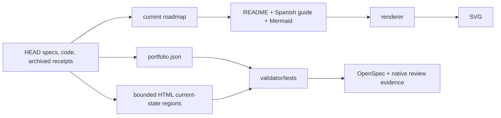

# Design: Refresh Platform Roadmap After Stabilization

## Technical Approach

Reconcile from evidence outward: preserve history, archive stale residue, repair portfolio evidence, update current guidance, then regenerate derivatives. Unit 4 runtime-risk work remains outside.

## Artifact Authority / Classification

| Artifact | Class / authority | Update rule |
|---|---|---|
| Current stabilization roadmap | Authoritative current sequence | Update from verified HEAD evidence. |
| `portfolio.json` | Authoritative product/dependency/evidence | Add only verified catalog pointers/status data. |
| Portfolio validator/tests | Executable policy authority | Extend deterministically, RED first. |
| Root README | Review-facing summary | Derive from portfolio/roadmap. |
| Current Mermaid | Authoritative diagram source | Edit to represent shipped components. |
| Current SVG | Derived/generated | Renderer only; never hand-edit. |
| Current Spanish guide | Review-facing derivative | Correct facts; preserve Spanish. |
| Platform HTML | Hand-authored mixed current/target source | Update bounded current-state content from HEAD; preserve labeled target/history and Spanish. |
| Active OpenSpec | Workflow authority | Keep this change and blocked `sp-data-environments`. |
| Archived OpenSpec | Historical/protected | Read/link only; never edit. |
| Baseline specs | Normative/protected | Read/link only. |
| Receipts/reviews/dated roadmaps | Historical/protected | Read/link only; never rewrite. |

Git history (`cc4529c`, `835eee6`) proves the HTML owns its content; no companion source exists. Reconcile current badges, component claims, and prose against portfolio, specs, and HEAD. Preserve and label future actor/control-plane/deployment flows as target-state/history, preserve `lang="es"` and Spanish, and forbid implementation implications. Parse HTML; require current/target labels and current-guide link; reject stale claims and broken links.

## Architecture Decisions

| Choice | Alternative | Rationale |
|---|---|---|
| Archive unchanged `CHG-FIRST-DATABASE-ADAPTER` under `archive/2026-07-16-CHG-FIRST-DATABASE-ADAPTER/`; add supersession report | Delete/rewrite | Removes false active inventory while pointing to the canonical spec and archived closure. |
| Catalog `S62` as archived parent `apply-progress.md` real-Docker receipt | Remove/invent evidence | The existing receipt records passing real-Docker scenarios. If unresolved after archival, remove both references and report the gap. |
| Extend the Python validator | Reviewer-only checks | One gate names structural, stale, inventory, link, and render failures. |
| Fixed renderer argv with `shell=False` | Shell composition | Prevents path/runtime injection and preserves the pinned Mermaid workflow. |

## Source-of-Truth Flow



```mermaid
sequenceDiagram
  participant A as Archivist
  participant P as Portfolio
  participant D as Current docs
  participant V as Validator
  A->>A: Move stale change; add supersession pointer
  A->>P: Resolve S62 to archived receipt
  P->>D: Reconcile current docs and HTML regions
  D->>V: Regenerate SVG; check claims/links/inventory
  V-->>A: Record canonical evidence or fail
```

Order: snapshot protected paths; archive stale change; resolve `S62`; update portfolio/roadmap, current docs, then HTML current regions; render; validate; record canonical evidence. Failure stops publication.

## File Changes

| Files | Action |
|---|---|
| roadmap, portfolio, README, guide, Mermaid, HTML | Modify within classified ownership boundaries. |
| `validate.py`, `test_validate.py` | Add repository/inventory/stale/link/renderer checks and tests; make CRITICAL/BLOCKER exit non-zero. |
| current SVG | Regenerate with `render-current-implementation.sh`. |
| active adapter change | Move unchanged; create supersession report. |
| OpenSpec `apply-progress.md`, later `verify-report.md`, native review receipt | Record commands/results through canonical SDD/review workflows; create no parallel receipt. |

## Validation and Testing

The sorted gate checks exact active inventory, claims and HTML labels, links/evidence paths, `S62`, and fixed-argv renderer `--check`. Fixtures prove every failure code; integration runs CLI, unit tests, renderer, HTML parsing, links, and inventory. Evidence belongs in `apply-progress.md`, `verify-report.md`, and the native review receipt.

## Threat Matrix

| Boundary | Applicability | Safe/failure behavior | Planned RED test |
|---|---|---|---|
| Documentation-like paths | Applicable | Only the fixed renderer executes; other inputs are data and fail allowlisting. | `requirements.txt`, `CMakeLists.txt`, executable MDX, and `README.sh` never execute. |
| Git repository selection | N/A — no Git process. | — | — |
| Commit state | N/A — no index handling. | — | — |
| Push state | N/A — no push. | — | — |
| PR commands | N/A — no PR automation. | — | — |

## Chained Rollout and Rollback

Feature Branch Chain: tracker → slice 1 inventory/portfolio/roadmap → slice 2 README/Spanish guide/Mermaid → slice 3 bounded HTML, validator/tests, SVG, canonical evidence. Each immediate-parent diff MUST be ≤400 authored lines and independently verified. SVG is excluded from authored risk but included in total diff, byte identity, and evidence. Revert in reverse; restore the active directory if archival fails. Never edit protected artifacts or SVG for rollback.

## Open Questions

None.
