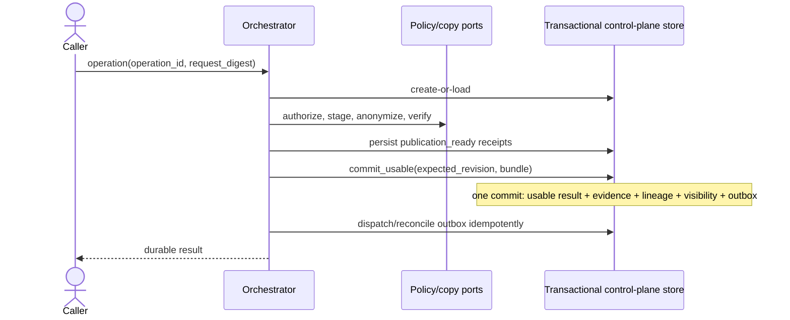

# Design: Managed Data Environments

## Technical Approach

Add a pure-core coordinator over accepted prerequisite contracts. A durable operation identity drives a fail-closed state machine. One provider-neutral aggregate commit binds terminal state, audit/lineage evidence, and authoritative visibility; retries and reconciliation make crash boundaries deterministic. Docker PostgreSQL is the decided first adapter, while its implementation remains prerequisite-owned and the outcome contracts remain provider-neutral.

## Component Boundaries

| Component | Responsibility |
|---|---|
| `data_environments/models.py` | Immutable request, pair, lineage, evidence, outcome, and state models. |
| `data_environments/service.py` | Pure transitions, gates, coherence checks, anonymization policy, and publication eligibility. |
| `ports/data_environment_dependencies.py` | Provider-neutral facades over accepted handoffs; opaque references only. |
| Application orchestrator | Replay operations, invoke ports, persist receipts, reconcile, and compensate. |
| Control-plane adapter | Atomically store outcomes, references, lineage, evidence, visibility, cleanup obligations, and outbox records. |

Existing backend providers remain unchanged. `DPROV-DB` selects Docker PostgreSQL as the exactly one first database adapter because it reuses the tested local backend and minimizes initial delivery risk. Runtime cutover and adapter delivery remain prerequisite-owned.

## Architecture Decisions

| Decision | Rejected alternative | Rationale |
|---|---|---|
| Transactional visibility aggregate keyed by operation ID | Separate terminal and publication writes | Prevents exposed targets with incomplete retry/audit state. |
| Transactional outbox for projections | Direct notifications | Durable, idempotent reconciliation without making projections authoritative. |
| Invocation ownership receipts | Name-based ownership inference | Compensation affects only invocation-created resources. |
| Evidence before non-anonymized copy | Post-copy evidence | Missing or denied approval fails before exposure. |
| Opaque control-plane references | Centralized data bytes | Preserves reference-only control-plane scope. |
| Docker PostgreSQL as the first adapter | AWS RDS or VPS PostgreSQL first | Reuses the existing tested local backend and minimizes initial delivery risk without coupling outcome contracts to one provider. |

## Consistency Protocol and Flow

`operation_id + request_digest` is the idempotency key: equal input replays; conflicting input fails. The accepted durable-operations/control-plane handoff MUST provide `commit_usable(operation_id, expected_revision, bundle)` or equivalent compare-and-swap aggregate transaction. The bundle contains both opaque component references, pair identity, compatible lineage, destination, ownership receipts, and either anonymization evidence or complete exception evidence (`actor`, `reason`, `source`, `destination`, `approval`, `outcome`).

States are monotonic: `requested → authorized → staging → validating → publication_ready → usable`; failure follows `failure_pending → compensating → failed|cleanup_required`. Only a committed visibility row in the `usable` aggregate is authoritative. The target remains hidden for absent/non-terminal state, `publication_ready`, every failure state, incomplete evidence, incoherent lineage, or unresolved commit outcome.

### Commit and crash boundaries

| Boundary | Recovery and retry behavior |
|---|---|
| Before `publication_ready` | Resume from durable receipts; never expose. |
| After `publication_ready`, before commit | Revalidate bundle and retry compare-and-swap; remain hidden. |
| During/unknown commit outcome | Transaction yields all-or-none; read by operation ID/revision, returning the committed result or retrying when absent. Remain hidden until commit is proven. |
| After commit, before response | Retry returns the same `usable` result; no new target or publication. |
| Before/during outbox delivery | Reconcile pending item keyed by `operation_id + terminal_revision`; duplicate delivery is a no-op. Visibility does not depend on projections. |

Failure terminalization atomically stores the failure outcome, audit evidence, compensation receipts, and residual-cleanup obligations. Reverse compensation preserves sources and pre-existing resources and removes only invocation-owned targets.

## File Changes

| File | Action | Description |
|---|---|---|
| `src/odoo_forge/data_environments/models.py` | Create | Outcome contracts and durable states. |
| `src/odoo_forge/data_environments/service.py` | Create | Transition and publication policy. |
| `src/odoo_forge/ports/data_environment_dependencies.py` | Create | Accepted-handoff facades. |
| `tests/data_environments/` | Create | Contract, transition, recovery, and property tests. |

Final wiring waits for prerequisite contracts; their files remain untouched.

## Testing Strategy

Focused architecture tests use a fake transactional store and injected crashes to prove: `publication_ready` is hidden; each partial aggregate write rolls back result/evidence/lineage/visibility/outbox together; unknown commit outcomes reconcile to exactly one result and target; post-commit retries replay; duplicate/delayed outbox delivery creates no visibility or target; failure terminalization cannot omit cleanup obligations; and control-plane records contain no data bytes. Unit/property tests cover transition monotonicity, digest conflicts, coherence, evidence completeness, and deterministic serialization. End-to-end proof waits for accepted evidence from `CHG-FIRST-DATABASE-ADAPTER`, `WF-DATA-COPY`, and `SP-CONTROL-PLANE-AUTHORITY`.

## Threat Matrix

N/A — no routing, shell, subprocess, VCS/PR automation, executable classification, or direct process-integration boundary is added. Provider process behavior remains prerequisite scope.

## Rollout and Rollback

`DPROV-DB` is resolved to Docker PostgreSQL, but implementation and acceptance remain blocked until every named handoff has approved evidence. Forced-chained delivery keeps each autonomous slice within 400 authored changed lines. Enable only after recovery and compensation tests pass. Rollback disables entry points, reconciles or compensates persisted operations, and preserves existing Docker behavior and data.

## Open Questions

Artifact reference shape, anonymization rules, approval authority/store, and the smallest usable control-plane handoff remain prerequisite-owned blockers.
