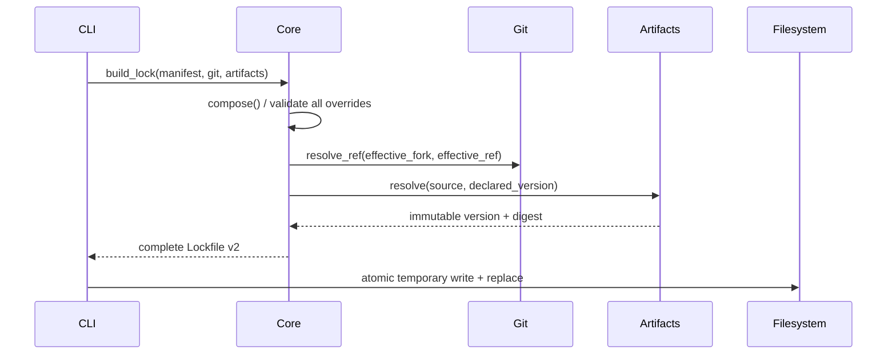

# Design: Decide Manifest Layer and Override Semantics

## Technical Approach

Keep manifest validation, effective-source selection, lock construction, and version dispatch in `odoo_forge`. Inject Git and published-artifact ports at the CLI composition root. Build a schema-v2 lock in memory, then retain the existing atomic write.



## Architecture Decisions

| Decision | Alternatives considered | Choice and rationale |
|---|---|---|
| Published resolution | Extend Git `SourceProvider`; reuse image port directly | Add `PublishedArtifactResolver` in `odoo_forge/ports/published_artifact_resolver.py`. It returns frozen `PublishedArtifactResolution(source, version, digest)` and raises typed `PublishedArtifactNotFoundError`, `PublishedArtifactDigestMissingError`, or `PublishedArtifactResolutionError`. Published artifacts are not Git refs, and a dedicated pure-core contract prevents transport semantics leaking into locking. |
| Dependency injection | Construct adapters in core; service locator | Change `build_lock(manifest, source_provider, artifact_resolver)` and add `_make_published_artifact_resolver()` beside `_make_provider()` in `odoo_forge_cli/main.py`. The CLI may import `odoo_forge_registry`; core imports only ports, preserving every `pyproject.toml` import-linter contract. The registry adapter maps `registry://<path>` plus version to its registry reference and translates registry failures/digest absence into the typed core failures. |
| Override semantics | Basename/canonical matching; post-resolution rewriting | In `compose()`, index only additional `GitLayer` repositories by exact declared URL. Reject repeated `(layer, repo)` targets, unknown layers/URLs, and published/core targets before either resolver is called. Locking replaces URL/ref with fork/ref, then invokes `resolve_ref`; the effective URL/ref/commit is persisted. This is deterministic and matches the approved coupling. |
| Lock shape/versioning | Mixed entry union; optional published fields in v1 | Schema v2 has `git_layers: list[ResolvedGitLayer]` and `published_layers: list[ResolvedPublishedLayer]`; the latter stores name/source/version/digest. `from_json` parses the object, treats absence as v1, explicitly accepts only `{1,2}`, rejects non-integer/unknown versions, and uses version-specific input models. V1 `layers` normalizes to `git_layers` without invented published entries; v1 serialization remains v1, while newly built locks are v2. A v1 model cannot contain published entries. |
| Determinism and safety | Hash raw YAML; overwrite in place | Preserve `compute_manifest_hash()` over canonical `Manifest.model_dump()` (therefore including overrides/published declarations). Canonical JSON keeps sorted keys, fixed indentation, semantic list order, and trailing newline. Resolve and serialize fully before `_write_lock_atomic`; any validation, resolution, serialization, or replace failure leaves an existing lock byte-identical and removes the temporary file. |
| Projection/drift | Project published artifacts as Git; include them in workspace drift | Update `plan_projection()` and `_lock_state_drift()` to iterate `git_layers` only. Current paths join lock repos to manifest layers and scanned Git state; published entries have no checkout/materialized-repo contract. Manifest-to-lock drift still uses the whole manifest hash, so published version/source changes remain detectable. |

## File Changes

| File | Action | Description |
|---|---|---|
| `src/odoo_forge/ports/published_artifact_resolver.py`, `src/odoo_forge/manifest/artifacts.py` | Create | Pure port, frozen result, typed failures. |
| `src/odoo_forge_registry/published_artifact_resolver.py` | Create | Registry-backed adapter and error translation. |
| `src/odoo_forge/manifest/{composition,locking,lockfile,projection,drift}.py` | Modify | Validation, effective resolution, v1/v2 models, consumer updates. |
| `src/odoo_forge_cli/main.py` | Modify | Compose/inject both resolvers and preserve resilient error/write boundary. |
| `tests/{ports,adapters,manifest,cli}/` | Modify/Create | Contract, scenario, compatibility, and failure tests. |

## Interfaces / Contracts

```python
class PublishedArtifactResolver(Protocol):
    def resolve(self, source: str, version: str) -> PublishedArtifactResolution: ...
```

## Testing Strategy

Strict RED-GREEN-REFACTOR maps all 12 scenarios: composition tests cover missing layer and the odoo-idp fire fixture; parameterized composition/locking tests cover duplicate, unknown URL, published, core, missing digest, and prove zero resolver calls; locking tests prove combined published/override pins and replacement-before-resolution; lockfile tests cover current version, key stability, v2 round-trip, versionless v1, and unknown-version rejection; CLI tests cover full pinned lock/readback, default core ref, clean resolution failure, and byte-identical write rollback. Projection/drift tests prove published entries are retained but not checked out or compared to Git state. Run focused pytest per work unit, then `uv run pytest`, `uv run lint-imports`, `uv run mypy`, and `uv run ruff check`.

## Review Work Units

Use a feature-branch chain only during apply: (1) v2 models/reader plus tests; (2) override validation/effective Git locking plus tests; (3) published port/adapter/DI plus tests; (4) projection, drift, CLI safety, and compatibility tests. Each unit includes its behavior and tests, targets the previous unit, stays below 400 authored changed lines, and can roll back independently. No PR is created now.

## Threat Matrix

N/A — no routing, shell-command construction, subprocess implementation, VCS/PR automation, executable classification, or process boundary is changed. The new adapter delegates through the existing registry provider; existing subprocess safety remains outside this design’s changed boundary.

## Migration / Rollout

No eager migration. V1 remains readable; the next successful lock rebuild writes v2. Rollback may restore v1 only for Git-only manifests. Retain v2 locks containing published entries: neither updated code nor rollback procedure may downgrade them by discarding `published_layers`. Pre-v2 binary behavior is unspecified, not claimed to reject v2.

## Open Questions

None.
